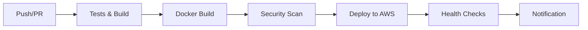

# 🚀 Configuration GitHub Actions CI/CD - Vibe-Tickets Backend

Ce document détaille la configuration complète des pipelines GitHub Actions pour le déploiement automatisé du backend Spring Boot de Vibe-Tickets.

## 📋 Table des matières

- [Vue d'ensemble](#vue-densemble)
- [Configuration des secrets](#configuration-des-secrets)
- [Variables d'environnement](#variables-denvironnement)
- [Workflows disponibles](#workflows-disponibles)
- [Déploiement](#déploiement)
- [Monitoring et debugging](#monitoring-et-debugging)
- [Troubleshooting](#troubleshooting)

## 🎯 Vue d'ensemble

### Architecture CI/CD



### Workflows configurés

1. **`backend-ci-cd.yml`** - Pipeline principal (main branch)
2. **`backend-pr.yml`** - Validation des Pull Requests

## 🔐 Configuration des secrets

### Secrets GitHub requis

Allez dans `Settings > Secrets and variables > Actions` de votre repository et ajoutez :

#### 🔑 Secrets AWS (obligatoires)

| Nom du secret | Description | Exemple |
|---------------|-------------|---------|
| `AWS_ACCESS_KEY_ID` | Clé d'accès AWS | `AKIA...` |
| `AWS_SECRET_ACCESS_KEY` | Clé secrète AWS | `wJalrXUt...` |
| `AWS_ACCOUNT_ID` | ID du compte AWS | `756942038699` |

#### 📧 Secrets de notification (optionnels)

| Nom du secret | Description | Utilisation |
|---------------|-------------|-------------|
| `SLACK_WEBHOOK_URL` | Webhook Slack | Notifications de déploiement |
| `DISCORD_WEBHOOK_URL` | Webhook Discord | Notifications alternatives |

### 🛠️ Création des credentials AWS

#### Option 1: Utilisateur IAM dédié (recommandé)

```bash
# 1. Créer un utilisateur IAM pour GitHub Actions
aws iam create-user --user-name github-actions-vibe-tickets

# 2. Attacher la politique personnalisée
aws iam attach-user-policy \
  --user-name github-actions-vibe-tickets \
  --policy-arn arn:aws:iam::YOUR_ACCOUNT_ID:policy/VibeTerraformPolicy

# 3. Créer les clés d'accès
aws iam create-access-key --user-name github-actions-vibe-tickets
```

#### Option 2: Utiliser vos clés existantes

Si vous utilisez déjà AWS CLI localement :

```bash
# Récupérer vos credentials
cat ~/.aws/credentials
```

### 🔒 Permissions IAM requises

Le fichier `terraform/iam-policy.json` contient les permissions nécessaires :

- **ECR** : Push/pull des images Docker
- **EC2** : Gestion des instances et clés SSH
- **RDS** : Accès aux bases de données
- **VPC** : Gestion du réseau
- **IAM** : Gestion des rôles pour EC2

## 🌍 Variables d'environnement

### Variables GitHub (Repository variables)

Allez dans `Settings > Secrets and variables > Actions > Variables` :

| Variable | Valeur | Description |
|----------|--------|-------------|
| `AWS_REGION` | `eu-west-3` | Région AWS par défaut |
| `ECR_REPOSITORY` | `vibe-tickets` | Nom du repository ECR |
| `TERRAFORM_VERSION` | `1.6.0` | Version de Terraform |

### Variables d'environnement dans les workflows

Les workflows utilisent automatiquement :

```yaml
env:
  AWS_REGION: eu-west-3
  ECR_REPOSITORY: vibe-tickets
  JAVA_VERSION: '21'
  MAVEN_OPTS: '-Xmx1024m -XX:MaxPermSize=256m'
```

## 🔄 Workflows disponibles

### 1. Pipeline principal (`backend-ci-cd.yml`)

**Déclencheurs :**
- Push sur `main` → Déploiement complet
- Push sur `develop` → Tests uniquement
- Workflow manuel → Paramètres personnalisables

**Étapes :**
1. **Tests & Build** - Tests unitaires, compilation Maven
2. **Docker Build** - Création image avec tag timestamp
3. **Deploy AWS** - Push ECR + déploiement Terraform
4. **Health Checks** - Validation du déploiement
5. **Notification** - Rapport de déploiement

### 2. Validation PR (`backend-pr.yml`)

**Déclencheurs :**
- Pull Request vers `main`
- Mise à jour de PR

**Étapes :**
1. **Validation rapide** - Compilation de base
2. **Tests complets** - Tous les tests avec PostgreSQL
3. **Validation Docker** - Build et test de l'image
4. **Commentaire PR** - Résumé des résultats

## 🚀 Déploiement

### Déploiement automatique

```bash
# 1. Faire vos modifications
git add .
git commit -m "feat: nouvelle fonctionnalité"

# 2. Push vers main pour déclencher le déploiement
git push origin main
```

### Déploiement manuel

1. Aller dans `Actions` > `Backend CI/CD Pipeline`
2. Cliquer sur `Run workflow`
3. Choisir l'environnement et les options
4. Cliquer sur `Run workflow`

### Paramètres de déploiement manuel

| Paramètre | Options | Description |
|-----------|---------|-------------|
| `environment` | `dev`, `staging`, `prod` | Environnement cible |
| `skip_tests` | `true`, `false` | Ignorer les tests (déconseillé) |

## 📊 Monitoring et debugging

### Logs et rapports

Les workflows génèrent automatiquement :

- **Rapports de tests** - Coverage et résultats JUnit
- **Rapports de sécurité** - Scan Trivy des images Docker
- **Logs de déploiement** - Détails Terraform et AWS
- **Health checks** - Validation post-déploiement

### Accès aux artefacts

1. Aller dans `Actions` > Sélectionner un workflow
2. Cliquer sur un job terminé
3. Télécharger les artefacts dans la section `Artifacts`

### Monitoring en temps réel

```bash
# Suivre les logs de déploiement
gh run watch

# Voir le statut des workflows
gh run list --workflow=backend-ci-cd.yml
```

## 🔧 Troubleshooting

### Problèmes courants

#### ❌ Erreur d'authentification AWS

```
Error: The security token included in the request is invalid
```

**Solutions :**
1. Vérifier que `AWS_ACCESS_KEY_ID` et `AWS_SECRET_ACCESS_KEY` sont corrects
2. Vérifier que l'utilisateur IAM a les bonnes permissions
3. Vérifier que les clés ne sont pas expirées

#### ❌ Erreur ECR "repository does not exist"

```
Error: Repository vibe-tickets does not exist
```

**Solutions :**
1. Créer le repository ECR manuellement :
   ```bash
   aws ecr create-repository --repository-name vibe-tickets --region eu-west-3
   ```
2. Vérifier la variable `ECR_REPOSITORY`

#### ❌ Timeout lors du health check

```
Error: Application non accessible après 300 secondes
```

**Solutions :**
1. Vérifier les logs EC2 :
   ```bash
   ssh -i terraform/ssh-key ec2-user@IP_EC2
   sudo docker logs vibe-tickets
   ```
2. Vérifier la configuration des security groups
3. Augmenter le timeout dans le workflow

#### ❌ Tests en échec

```
Error: Tests failed
```

**Solutions :**
1. Exécuter les tests localement :
   ```bash
   mvn test
   ```
2. Vérifier la configuration PostgreSQL de test
3. Consulter les rapports de tests dans les artefacts

### Debug avancé

#### Activer les logs détaillés

Ajouter dans le workflow :

```yaml
env:
  ACTIONS_STEP_DEBUG: true
  ACTIONS_RUNNER_DEBUG: true
```

#### Connexion SSH pour debug

En cas de problème de déploiement :

```bash
# Récupérer l'IP EC2 depuis les outputs Terraform
terraform output ec2_public_ip

# Se connecter en SSH
ssh -i terraform/ssh-key ec2-user@IP_EC2

# Vérifier les logs
sudo docker logs vibe-tickets
sudo journalctl -u docker
```

## 📞 Support

### Ressources utiles

- [Documentation GitHub Actions](https://docs.github.com/en/actions)
- [Documentation AWS CLI](https://docs.aws.amazon.com/cli/)
- [Documentation Terraform](https://www.terraform.io/docs)

### Contacts

- **Développeur principal** : Simon
- **Repository** : [vibe-tickets](https://github.com/your-username/vibe-tickets)
- **Issues** : [GitHub Issues](https://github.com/your-username/vibe-tickets/issues)

---

*Documentation générée automatiquement pour le projet Vibe-Tickets*
